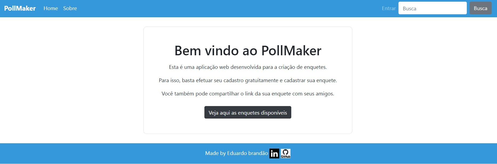
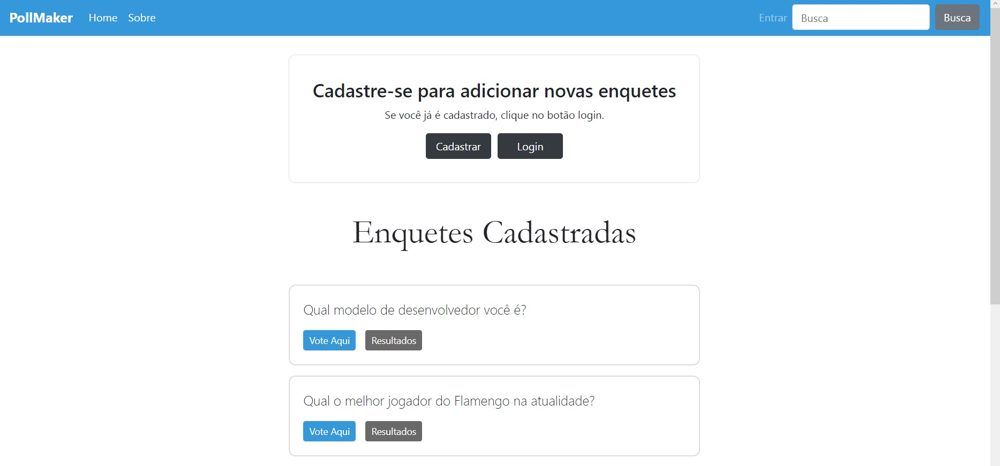

# App PollMaker
Este repositório trata-se da versão 1.0 para um sistema de enquetes interativa.

# APRESENTACAO
Construir uma aplicação web para que o usuário seja capaz de:
- Visualizar o layout da pagina independente do tamanho da tela do dispositivo;
- Visualizar e responder perguntas das enquetes;
- Visualizar as respostas das enquetes;
- Compartilhar o link das páginas de votação e resultados clicando no botão 'copiar';
- Ser capaz de realizar um cadastro de usuario;
- Efetuar login com o usuário cadastrado;
- Fazer uma busca nos nomes das enquetes cadastradas através do campo de busca;
- Encaminhar e-mail com sugestões e/ou críticas através da seção Sobre;

# METODOLOGIA
Aplicação de conceitos em:
- Python
- Django
- HTML;
- CSS;
- Bootstrap;
- Layouts Responsivos.
- Banco de Dados

# SCREENSHOTS DO PROJETO

# LINK DO PROJETO
Para visualizar o projeto no seu navegador utilize o link abaixo:

https://sistema-enquetes.herokuapp.com
